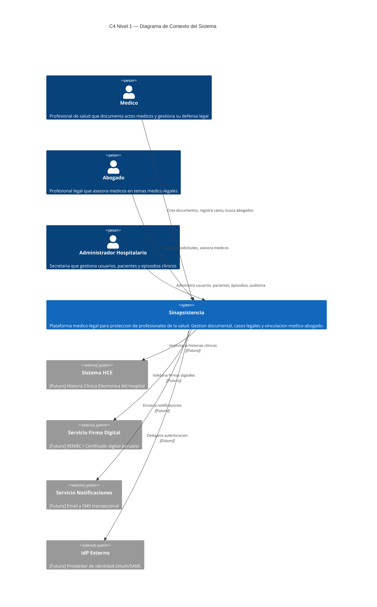
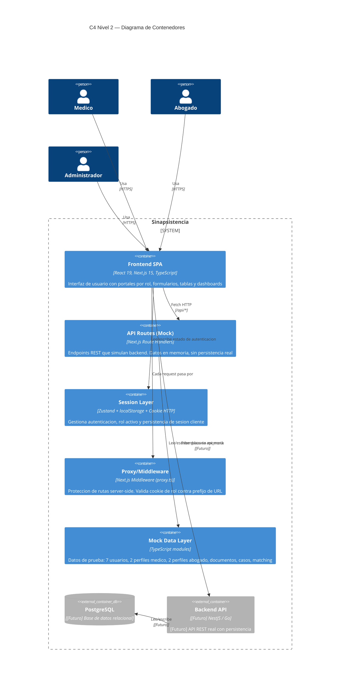
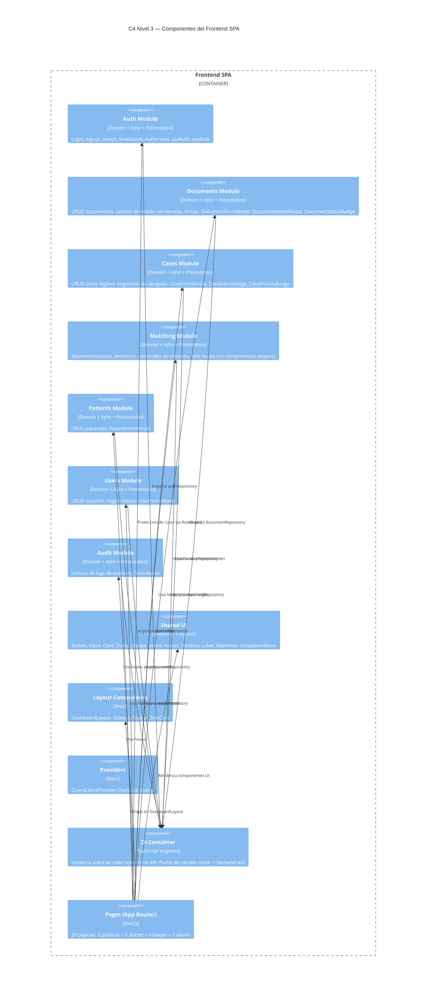
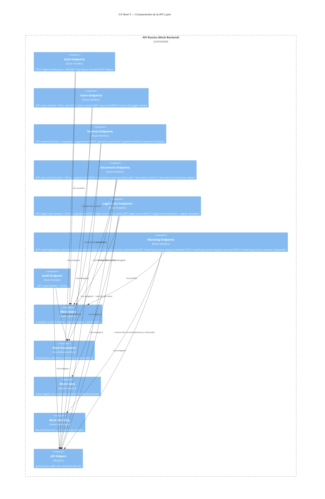
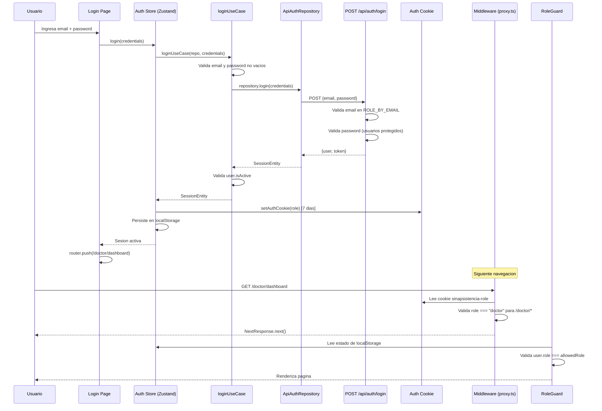
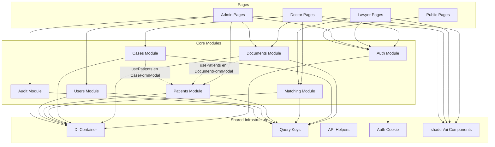

# Documentacion Arquitectonica — Sinapsistencia

## Modelo C4 + Modelo Entidad-Relacion

> Documento generado a partir del analisis del codigo fuente real del proyecto.
> Fecha de generacion: 2026-04-06
> Version del proyecto: commit `6ae49d6` (branch master)

---

# 1. Resumen de Analisis del Codigo

## 1.1 Estructura general

El proyecto es una **Single Page Application** construida con Next.js 15 (App Router), TypeScript strict, Tailwind CSS, shadcn/ui, TanStack Query, Zustand y React Hook Form + Zod. Sigue principios de **Clean Architecture** con separacion en capas Domain / Infrastructure / Presentation por modulo.

```
src/
  app/                  # Next.js App Router (pages + API Routes)
  modules/              # Modulos de dominio (DDD vertical slicing)
  components/           # Componentes compartidos (UI, layout, navigation)
  infrastructure/       # DI container + HTTP client
  lib/                  # Utilidades (api, cookies, query keys)
  mocks/                # Datos mock (users, documents, cases, matching)
  store/                # Re-exports de stores Zustand
  types/                # Tipos globales del dominio
  constants/            # Labels, badges, navegacion
  validators/           # Schemas Zod
  proxy.ts              # Middleware Next.js (proteccion de rutas)
```

## 1.2 Modulos detectados

| Modulo | Ruta base | Capas implementadas | Estado |
|--------|-----------|---------------------|--------|
| **Auth** | `modules/auth/` | Domain + Infrastructure + Presentation | Completo |
| **Documents** | `modules/documents/` | Domain + Infrastructure + Presentation | Completo |
| **Cases** | `modules/cases/` | Domain + Infrastructure + Presentation | Completo |
| **Matching** | `modules/matching/` | Domain + Infrastructure + Presentation | Completo |
| **Patients** | `modules/patients/` | Domain + Infrastructure + Presentation | Completo |
| **Users** | `modules/users/` | Domain + Infrastructure + Presentation | Completo |
| **Audit** | `modules/audit/` | Domain + Infrastructure + Presentation | Completo |

## 1.3 Actores del sistema

| Actor | Rol tecnico | Descripcion |
|-------|-------------|-------------|
| **Medico** | `doctor` | Profesional de salud que documenta actos medicos, gestiona casos legales y busca asesoramiento |
| **Abogado** | `lawyer` | Profesional legal que recibe solicitudes, asesora medicos y gestiona casos |
| **Administrador** | `admin` | Secretaria hospitalaria que gestiona usuarios, pacientes, documentos y episodios clinicos |

## 1.4 Rutas del sistema

### Paginas publicas
| Ruta | Proposito |
|------|-----------|
| `/` | Landing page |
| `/login` | Inicio de sesion |
| `/register` | Solicitud de acceso |

### Portal Medico (`/doctor/*`)
| Ruta | Proposito |
|------|-----------|
| `/doctor/dashboard` | Resumen de casos, documentos, recomendaciones |
| `/doctor/cases` | Listado de casos legales propios |
| `/doctor/cases/[id]` | Detalle de un caso legal |
| `/doctor/documents` | Gestion de documentos clinico-legales |
| `/doctor/lawyers` | Directorio de abogados + recomendaciones |
| `/doctor/profile` | Perfil profesional del medico |

### Portal Abogado (`/lawyer/*`)
| Ruta | Proposito |
|------|-----------|
| `/lawyer/dashboard` | Solicitudes pendientes y casos activos |
| `/lawyer/requests` | Gestion de solicitudes de contacto |
| `/lawyer/doctors` | Directorio de medicos |
| `/lawyer/profile` | Perfil profesional del abogado |

### Portal Administrador (`/admin/*`)
| Ruta | Proposito |
|------|-----------|
| `/admin/dashboard` | Estadisticas globales del sistema |
| `/admin/users` | Gestion de usuarios |
| `/admin/patients` | Gestion de pacientes |
| `/admin/documents` | Supervision de documentos |
| `/admin/episodes` | Episodios clinicos hospitalarios |
| `/admin/audit` | Registro de auditoria |

## 1.5 API Routes (Mock Backend)

| Endpoint | Metodos | Entidades |
|----------|---------|-----------|
| `/api/auth/login` | POST | User, Session |
| `/api/auth/logout` | POST | Session |
| `/api/auth/me` | GET | User |
| `/api/users` | GET, POST | User |
| `/api/users/[id]` | GET, PATCH | User |
| `/api/patients` | GET, POST | Patient |
| `/api/patients/[id]` | GET, PUT | Patient |
| `/api/documents` | GET, POST | Document |
| `/api/documents/[id]` | GET, PUT | Document |
| `/api/legal-cases` | GET, POST | LegalCase |
| `/api/legal-cases/[id]` | GET, PUT | LegalCase |
| `/api/matching/lawyers` | GET | LawyerProfile, MatchRecommendation |
| `/api/matching/doctors` | GET | DoctorProfile |
| `/api/matching/contact-requests` | GET, POST, PATCH | ContactRequest |
| `/api/audit` | GET | AuditLog |

**Total: 16 archivos de ruta, 25 operaciones HTTP**

## 1.6 Hallazgos importantes

1. **Arquitectura limpia real**: cada modulo respeta Domain > Infrastructure > Presentation con interfaces de repositorio e inyeccion de dependencias via container singleton.
2. **Doble implementacion de repositorios**: cada modulo tiene `ApiXxxRepository` (usado) y `MockXxxRepository` (disponible), lo que facilita la migracion a backend real.
3. **Datos mock como backend**: las API Routes de Next.js consumen datos mock en memoria; no hay persistencia real entre reinicios del servidor.
4. **Duplicacion de tipos**: los tipos de dominio se definen en `src/types/index.ts` (tipos globales con referencias anidadas) y en cada `module/domain/entities/` (entidades aplanadas con campos string). Esto es intencional: los tipos globales representan el modelo relacional y las entidades de modulo representan DTOs optimizados para la UI.
5. **Patron Snapshot en Cases**: el modulo de casos usa `DoctorSnapshot`, `LawyerSnapshot`, `PatientSnapshot` en vez de referencias completas, siguiendo el principio de bounded context.
6. **Entidades sin implementacion completa**: `Hospital`, `ClinicalEpisode`, `ConsentRecord`, `SignatureRecord` estan definidos como tipos pero no tienen mocks, API routes ni UI funcional.

---

# 2. C4 Nivel 1 — System Context Diagram

## 2.1 Descripcion

Sinapsistencia es una plataforma medico-legal que conecta tres actores principales: profesionales de la salud (medicos), profesionales legales (abogados) y la administracion hospitalaria. El sistema actua como punto central de gestion documental clinico-legal, vinculacion medico-abogado y trazabilidad de procesos.

Los sistemas externos son **futuros** (no implementados actualmente):
- **Servicio de autenticacion externo** (OAuth/SAML del hospital)
- **Sistema de historia clinica electronica** (HCE/EHR)
- **Servicio de firma digital** (RENIEC/certificado digital peruano)
- **Sistema de notificaciones** (email/SMS)

## 2.2 Diagrama



---

# 3. C4 Nivel 2 — Container Diagram

## 3.1 Descripcion

El sistema actual es una **aplicacion monolitica Next.js** que actua simultaneamente como frontend SPA y backend mock. La separacion logica entre capas es fuerte, pero fisicamente todo corre en un unico proceso Node.js.

### Contenedores actuales (implementados)

| Contenedor | Tecnologia | Responsabilidad |
|------------|------------|-----------------|
| **Frontend SPA** | React 19 + Next.js App Router | Interfaz de usuario con routing por rol, forms, tablas, dashboards |
| **API Routes (Mock)** | Next.js Route Handlers | Endpoints REST que simulan un backend con datos en memoria |
| **Session Layer** | Zustand + localStorage + Cookie | Persistencia de sesion del lado del cliente |
| **Mock Data Layer** | TypeScript modules en `/mocks/` | Datos de prueba para usuarios, documentos, casos, matching |

### Contenedores futuros (planificados, no implementados)

| Contenedor | Tecnologia sugerida | Responsabilidad |
|------------|---------------------|-----------------|
| **Backend API** | Node.js/NestJS o Go | API REST real con logica de negocio, validacion, autenticacion |
| **Base de datos** | PostgreSQL | Persistencia relacional de todas las entidades |
| **Cache** | Redis | Sesiones, cache de queries frecuentes |
| **Object Storage** | S3/MinIO | Archivos adjuntos, PDFs firmados |

## 3.2 Diagrama



---

# 4. C4 Nivel 3 — Component Diagrams

## 4.1 Frontend SPA — Componentes

### 4.1.1 Descripcion

El frontend esta organizado en **modulos verticales** (feature modules) y **componentes compartidos**. Cada modulo de dominio sigue la estructura:

```
modules/{nombre}/
  domain/
    entities/          # Interfaces de entidad (DTOs del dominio)
    repositories/      # Interfaces de repositorio (puertos)
    use-cases/         # Logica de negocio pura (sin side-effects)
  infrastructure/
    repositories/      # Implementaciones (ApiXxx + MockXxx)
  presentation/
    hooks/             # React hooks (TanStack Query wrappers)
    components/        # Componentes React especificos del modulo
    stores/            # Zustand stores (solo auth)
```

### 4.1.2 Diagrama



## 4.2 API Layer — Componentes

### 4.2.1 Descripcion

La capa de API es un conjunto de **Route Handlers** de Next.js que actuan como backend mock. Cada grupo de endpoints consume datos de los modulos `src/mocks/` y aplica filtrado, paginacion y busqueda en memoria.

### 4.2.2 Diagrama



## 4.3 Flujo de autenticacion (secuencia)



---

# 5. Modelo Entidad-Relacion — Estado Actual

## 5.1 Descripcion

Este modelo refleja las entidades que **estan definidas como tipos en el codigo** (`src/types/index.ts`) y su nivel de implementacion real.

### Leyenda de estado

| Simbolo | Significado |
|---------|-------------|
| **COMPLETO** | Tipo + Mock + API Route + UI funcional |
| **PARCIAL** | Tipo definido + algo de implementacion (mock o UI pero no ambos) |
| **SOLO TIPO** | Solo existe la interfaz TypeScript, sin implementacion |

### Entidades y su estado

| Entidad | Estado | Tipo | Mock | API | UI |
|---------|--------|------|------|-----|----|
| User | COMPLETO | `types/index.ts` | `mocks/users.ts` | `/api/users` | `/admin/users` |
| DoctorProfile | COMPLETO | `types/index.ts` | `mocks/users.ts` | `/api/matching/doctors` | `/lawyer/doctors`, perfiles |
| LawyerProfile | COMPLETO | `types/index.ts` | `mocks/users.ts` | `/api/matching/lawyers` | `/doctor/lawyers`, perfiles |
| AdminProfile | PARCIAL | `types/index.ts` | `mocks/users.ts` | No endpoint propio | Solo dashboard |
| Hospital | SOLO TIPO | `types/index.ts` | No | No | No |
| Patient | COMPLETO | `types/index.ts` | `mocks/documents.ts` | `/api/patients` | `/admin/patients` |
| ClinicalEpisode | SOLO TIPO | `types/index.ts` | No | No | Pagina existe pero muestra casos |
| Document | COMPLETO | `types/index.ts` | `mocks/documents.ts` | `/api/documents` | `/doctor/documents`, `/admin/documents` |
| DocumentVersion | PARCIAL | `types/index.ts` | Embebido en Document mock | No endpoint propio | Solo lectura en detalle |
| SignatureRecord | SOLO TIPO | `types/index.ts` | Referenciado en Document | No endpoint propio | Solo lectura conteo |
| ConsentRecord | SOLO TIPO | `types/index.ts` | No | No | No |
| LegalCase | COMPLETO | `types/index.ts` | `mocks/cases.ts` | `/api/legal-cases` | `/doctor/cases` |
| MatchRecommendation | COMPLETO | `types/index.ts` | `mocks/matching.ts` | `/api/matching/lawyers?doctorId=` | `/doctor/lawyers` |
| ContactRequest | COMPLETO | `types/index.ts` | `mocks/matching.ts` | `/api/matching/contact-requests` | `/lawyer/requests` |
| AuditLog | COMPLETO | `types/index.ts` | `mocks/documents.ts` | `/api/audit` | `/admin/audit` |

## 5.2 Diagrama ER actual

```mermaid
erDiagram
    USER {
        string id PK
        string email UK
        string name
        enum role "doctor | lawyer | admin"
        string avatar
        boolean isActive
        datetime createdAt
    }

    DOCTOR_PROFILE {
        string id PK
        string userId FK
        string cmp UK "Colegio Medico del Peru"
        string specialty
        string hospital
        string hospitalId
        int yearsExperience
        string phone
        string bio
    }

    LAWYER_PROFILE {
        string id PK
        string userId FK
        string cab UK "Colegio de Abogados"
        string[] specialties
        int yearsExperience
        string phone
        string bio
        boolean available
        float rating
        int casesHandled
    }

    ADMIN_PROFILE {
        string id PK
        string userId FK
        string hospital
        string hospitalId
        string department
    }

    PATIENT {
        string id PK
        string dni UK
        string name
        string lastName
        date birthDate
        enum gender "M | F | other"
        string phone
        string email
        string address
        string bloodType
        datetime createdAt
    }

    DOCUMENT {
        string id PK
        string title
        enum type "8 tipos"
        enum status "borrador | pendiente_firma | firmado | archivado"
        string episodeId FK "opcional"
        string patientId FK "opcional"
        string authorId FK
        string currentVersionId
        datetime createdAt
        datetime updatedAt
    }

    DOCUMENT_VERSION {
        string id PK
        string documentId FK
        int version
        string content
        string fileUrl
        int fileSize
        string mimeType
        string createdById FK
        datetime createdAt
        string notes
    }

    SIGNATURE_RECORD {
        string id PK
        string documentId FK
        string signerId FK
        enum type "digital | huella | firma_manuscrita"
        datetime signedAt
        string ipAddress
        boolean isValid
        string hash
    }

    CONSENT_RECORD {
        string id PK
        string documentId FK
        string patientId FK
        string doctorId FK
        enum status "pendiente | firmado | rechazado | expirado"
        datetime signedAt
        datetime expiresAt
        string ipAddress
        string notes
        datetime createdAt
    }

    LEGAL_CASE {
        string id PK
        string title
        string description
        enum status "nuevo | en_revision | activo | cerrado | archivado"
        enum priority "baja | media | alta | critica"
        string doctorId FK
        string lawyerId FK "opcional"
        string patientId FK "opcional"
        string episodeId FK "opcional"
        string notes
        datetime createdAt
        datetime updatedAt
    }

    MATCH_RECOMMENDATION {
        string id PK
        string doctorId FK
        string lawyerId FK
        float score "0 a 100"
        string[] reasons
        datetime createdAt
    }

    CONTACT_REQUEST {
        string id PK
        string fromDoctorId FK
        string toLawyerId FK
        string caseId FK "opcional"
        enum status "pendiente | aceptado | rechazado | cancelado"
        string message
        string responseMessage
        datetime createdAt
        datetime respondedAt
    }

    AUDIT_LOG {
        string id PK
        string userId FK
        enum action "login | logout | create | update | delete | view | sign | download | share"
        string resource
        string resourceId
        string description
        string ipAddress
        string userAgent
        json metadata
        datetime createdAt
    }

    CLINICAL_EPISODE {
        string id PK
        string patientId FK
        string doctorId FK
        string hospitalId
        string title
        string description
        string diagnosis
        enum status "active | closed | archived"
        date startDate
        date endDate
        datetime createdAt
    }

    HOSPITAL {
        string id PK
        string name
        string address
        string city
        string region
        string phone
        boolean isActive
    }

    %% === RELACIONES ===

    USER ||--o| DOCTOR_PROFILE : "tiene perfil medico"
    USER ||--o| LAWYER_PROFILE : "tiene perfil abogado"
    USER ||--o| ADMIN_PROFILE : "tiene perfil admin"

    DOCTOR_PROFILE ||--o{ LEGAL_CASE : "registra"
    LAWYER_PROFILE |o--o{ LEGAL_CASE : "asesora (opcional)"
    PATIENT |o--o{ LEGAL_CASE : "vinculado (opcional)"

    USER ||--o{ DOCUMENT : "es autor"
    PATIENT |o--o{ DOCUMENT : "asociado (opcional)"
    DOCUMENT ||--o{ DOCUMENT_VERSION : "tiene versiones"
    DOCUMENT ||--o{ SIGNATURE_RECORD : "tiene firmas"
    USER ||--o{ SIGNATURE_RECORD : "firma como"

    DOCUMENT ||--o{ CONSENT_RECORD : "genera consentimiento"
    PATIENT ||--o{ CONSENT_RECORD : "otorga consentimiento"
    DOCTOR_PROFILE ||--o{ CONSENT_RECORD : "solicita consentimiento"

    PATIENT ||--o{ CLINICAL_EPISODE : "tiene episodios"
    DOCTOR_PROFILE ||--o{ CLINICAL_EPISODE : "atiende"

    DOCTOR_PROFILE ||--o{ MATCH_RECOMMENDATION : "recibe recomendaciones"
    LAWYER_PROFILE ||--o{ MATCH_RECOMMENDATION : "es recomendado"

    DOCTOR_PROFILE ||--o{ CONTACT_REQUEST : "envia solicitud"
    LAWYER_PROFILE ||--o{ CONTACT_REQUEST : "recibe solicitud"
    LEGAL_CASE |o--o{ CONTACT_REQUEST : "asociado (opcional)"

    USER ||--o{ AUDIT_LOG : "genera actividad"
```



## 5.3 Relaciones detalladas

| Relacion | Cardinalidad | Estado |
|----------|-------------|--------|
| User -> DoctorProfile | 1:0..1 | COMPLETO |
| User -> LawyerProfile | 1:0..1 | COMPLETO |
| User -> AdminProfile | 1:0..1 | PARCIAL (sin endpoint propio) |
| User -> Document (como autor) | 1:N | COMPLETO |
| User -> SignatureRecord (como firmante) | 1:N | SOLO TIPO |
| User -> AuditLog | 1:N | COMPLETO |
| Patient -> Document | 0..1:N | COMPLETO |
| Patient -> LegalCase | 0..1:N | COMPLETO |
| Patient -> ClinicalEpisode | 1:N | SOLO TIPO |
| Patient -> ConsentRecord | 1:N | SOLO TIPO |
| DoctorProfile -> LegalCase | 1:N | COMPLETO |
| LawyerProfile -> LegalCase | 0..1:N | COMPLETO |
| DoctorProfile -> ClinicalEpisode | 1:N | SOLO TIPO |
| DoctorProfile -> ConsentRecord | 1:N | SOLO TIPO |
| DoctorProfile -> MatchRecommendation | 1:N | COMPLETO |
| LawyerProfile -> MatchRecommendation | 1:N | COMPLETO |
| DoctorProfile -> ContactRequest (from) | 1:N | COMPLETO |
| LawyerProfile -> ContactRequest (to) | 1:N | COMPLETO |
| LegalCase -> ContactRequest | 0..1:N | COMPLETO |
| Document -> DocumentVersion | 1:N | PARCIAL (solo lectura) |
| Document -> SignatureRecord | 1:N | SOLO TIPO |
| Document -> ConsentRecord | 1:N | SOLO TIPO |
| Document -> ClinicalEpisode (via episodeId) | N:0..1 | SOLO TIPO |
| LegalCase -> ClinicalEpisode (via episodeId) | N:0..1 | SOLO TIPO |

---

# 6. Modelo ER Futuro Recomendado

## 6.1 Descripcion

El modelo futuro incorpora las entidades que actualmente estan como SOLO TIPO, completa las relaciones parciales, agrega tablas de soporte necesarias para un backend real, y normaliza la estructura para PostgreSQL.

### Cambios respecto al modelo actual

| Cambio | Justificacion |
|--------|---------------|
| **Hospital como entidad completa** | Soporte multi-hospital, normalizar `hospitalId` en profiles |
| **ClinicalEpisode implementado** | Separar claramente de LegalCase (admin gestiona episodios, no casos legales) |
| **ConsentRecord implementado** | Flujo de consentimiento informado con firma del paciente |
| **SignatureRecord con endpoint** | Flujo de firma digital con validacion, hash y auditoria |
| **Tabla de Password/Credential** | Autenticacion real con hash bcrypt |
| **Tabla CaseDocument (M:N)** | Un caso puede tener multiples documentos y un documento puede estar en multiples casos |
| **NotificationRecord** | Registro de notificaciones enviadas |
| **Indices y constraints** | Unique constraints, indices compuestos, soft delete |

## 6.2 Diagrama ER futuro

```mermaid
erDiagram
    USER {
        uuid id PK
        string email UK
        string name
        enum role "doctor | lawyer | admin"
        string avatarUrl
        boolean isActive
        timestamp createdAt
        timestamp updatedAt
        timestamp deletedAt "soft delete"
    }

    USER_CREDENTIAL {
        uuid id PK
        uuid userId FK UK
        string passwordHash "bcrypt"
        string resetToken
        timestamp resetTokenExpiresAt
        timestamp lastLoginAt
        int failedAttempts
        timestamp lockedUntil
        timestamp createdAt
    }

    HOSPITAL {
        uuid id PK
        string name
        string ruc UK "RUC peruano"
        string address
        string city
        string region
        string phone
        boolean isActive
        timestamp createdAt
    }

    DOCTOR_PROFILE {
        uuid id PK
        uuid userId FK UK
        uuid hospitalId FK
        string cmp UK
        string specialty
        int yearsExperience
        string phone
        text bio
        timestamp createdAt
    }

    LAWYER_PROFILE {
        uuid id PK
        uuid userId FK UK
        string cab UK
        int yearsExperience
        string phone
        text bio
        boolean available
        float rating
        int casesHandled
        timestamp createdAt
    }

    LAWYER_SPECIALTY {
        uuid id PK
        uuid lawyerProfileId FK
        string specialty
    }

    ADMIN_PROFILE {
        uuid id PK
        uuid userId FK UK
        uuid hospitalId FK
        string department
        timestamp createdAt
    }

    PATIENT {
        uuid id PK
        string dni UK
        string name
        string lastName
        date birthDate
        enum gender "M | F | other"
        string phone
        string email
        string address
        string bloodType
        timestamp createdAt
        timestamp updatedAt
    }

    CLINICAL_EPISODE {
        uuid id PK
        uuid patientId FK
        uuid doctorId FK
        uuid hospitalId FK
        string title
        text description
        string diagnosis
        enum status "active | closed | archived"
        date startDate
        date endDate
        timestamp createdAt
        timestamp updatedAt
    }

    DOCUMENT {
        uuid id PK
        string title
        enum type "8 tipos"
        enum status "borrador | pendiente_firma | firmado | archivado"
        uuid episodeId FK "nullable"
        uuid patientId FK "nullable"
        uuid authorId FK
        uuid currentVersionId FK
        timestamp createdAt
        timestamp updatedAt
    }

    DOCUMENT_VERSION {
        uuid id PK
        uuid documentId FK
        int version
        text content
        string fileUrl
        int fileSize
        string mimeType
        uuid createdById FK
        string notes
        timestamp createdAt
    }

    SIGNATURE_RECORD {
        uuid id PK
        uuid documentId FK
        uuid signerId FK
        enum type "digital | huella | firma_manuscrita"
        timestamp signedAt
        string ipAddress
        boolean isValid
        string hash "SHA-256"
        string certificateId "referencia a certificado digital"
        timestamp createdAt
    }

    CONSENT_RECORD {
        uuid id PK
        uuid documentId FK
        uuid patientId FK
        uuid doctorId FK
        enum status "pendiente | firmado | rechazado | expirado"
        timestamp signedAt
        timestamp expiresAt
        string ipAddress
        text notes
        string signatureHash
        timestamp createdAt
    }

    LEGAL_CASE {
        uuid id PK
        string title
        text description
        enum status "nuevo | en_revision | activo | cerrado | archivado"
        enum priority "baja | media | alta | critica"
        uuid doctorId FK
        uuid lawyerId FK "nullable"
        uuid patientId FK "nullable"
        uuid episodeId FK "nullable"
        text notes
        timestamp createdAt
        timestamp updatedAt
        timestamp closedAt
    }

    CASE_DOCUMENT {
        uuid id PK
        uuid caseId FK
        uuid documentId FK
        timestamp linkedAt
    }

    CASE_ATTACHMENT {
        uuid id PK
        uuid caseId FK
        string fileName
        string fileUrl
        string mimeType
        int fileSize
        uuid uploadedById FK
        timestamp createdAt
    }

    MATCH_RECOMMENDATION {
        uuid id PK
        uuid doctorId FK
        uuid lawyerId FK
        float score
        jsonb reasons
        string algorithm "version del algoritmo"
        timestamp createdAt
        timestamp expiresAt
    }

    CONTACT_REQUEST {
        uuid id PK
        uuid fromDoctorId FK
        uuid toLawyerId FK
        uuid caseId FK "nullable"
        enum status "pendiente | aceptado | rechazado | cancelado"
        text message
        text responseMessage
        timestamp createdAt
        timestamp respondedAt
    }

    AUDIT_LOG {
        uuid id PK
        uuid userId FK
        enum action "login | logout | create | update | delete | view | sign | download | share"
        string resource
        uuid resourceId
        text description
        string ipAddress
        string userAgent
        jsonb metadata
        timestamp createdAt
    }

    NOTIFICATION {
        uuid id PK
        uuid userId FK
        enum channel "email | sms | push"
        string subject
        text body
        enum status "pending | sent | failed"
        jsonb metadata
        timestamp sentAt
        timestamp createdAt
    }

    %% === RELACIONES ===

    USER ||--|| USER_CREDENTIAL : "tiene credenciales"
    USER ||--o| DOCTOR_PROFILE : "perfil medico"
    USER ||--o| LAWYER_PROFILE : "perfil abogado"
    USER ||--o| ADMIN_PROFILE : "perfil admin"

    HOSPITAL ||--o{ DOCTOR_PROFILE : "emplea"
    HOSPITAL ||--o{ ADMIN_PROFILE : "emplea"
    HOSPITAL ||--o{ CLINICAL_EPISODE : "ocurre en"

    LAWYER_PROFILE ||--o{ LAWYER_SPECIALTY : "tiene especialidades"

    PATIENT ||--o{ CLINICAL_EPISODE : "tiene episodios"
    DOCTOR_PROFILE ||--o{ CLINICAL_EPISODE : "atiende"

    USER ||--o{ DOCUMENT : "es autor"
    PATIENT |o--o{ DOCUMENT : "asociado"
    CLINICAL_EPISODE |o--o{ DOCUMENT : "genera documentos"
    DOCUMENT ||--o{ DOCUMENT_VERSION : "versionado"
    DOCUMENT ||--o{ SIGNATURE_RECORD : "firmado por"
    USER ||--o{ SIGNATURE_RECORD : "firma"
    DOCUMENT ||--o{ CONSENT_RECORD : "requiere consentimiento"
    PATIENT ||--o{ CONSENT_RECORD : "otorga"
    DOCTOR_PROFILE ||--o{ CONSENT_RECORD : "solicita"

    DOCTOR_PROFILE ||--o{ LEGAL_CASE : "registra"
    LAWYER_PROFILE |o--o{ LEGAL_CASE : "asesora"
    PATIENT |o--o{ LEGAL_CASE : "involucrado"
    CLINICAL_EPISODE |o--o{ LEGAL_CASE : "origina"

    LEGAL_CASE ||--o{ CASE_DOCUMENT : "contiene"
    DOCUMENT ||--o{ CASE_DOCUMENT : "vinculado a caso"
    LEGAL_CASE ||--o{ CASE_ATTACHMENT : "tiene adjuntos"
    USER ||--o{ CASE_ATTACHMENT : "sube"

    DOCTOR_PROFILE ||--o{ MATCH_RECOMMENDATION : "recibe"
    LAWYER_PROFILE ||--o{ MATCH_RECOMMENDATION : "recomendado"

    DOCTOR_PROFILE ||--o{ CONTACT_REQUEST : "envia"
    LAWYER_PROFILE ||--o{ CONTACT_REQUEST : "recibe"
    LEGAL_CASE |o--o{ CONTACT_REQUEST : "asociado"

    USER ||--o{ AUDIT_LOG : "genera"
    USER ||--o{ NOTIFICATION : "recibe"
```

## 6.3 Nuevas entidades vs. modelo actual

| Entidad | Cambio | Justificacion |
|---------|--------|---------------|
| `USER_CREDENTIAL` | **Nueva** | Separar datos de autenticacion del perfil de usuario. Permite hash de password, reset tokens, bloqueo por intentos |
| `HOSPITAL` | **Activada** | Normalizar la referencia a hospital que hoy es un string suelto en DoctorProfile y AdminProfile |
| `LAWYER_SPECIALTY` | **Nueva** | Normalizar el array `specialties[]` a una tabla relacional (1:N). Permite busquedas e indices eficientes |
| `CLINICAL_EPISODE` | **Activada** | Implementar el tipo que ya existe. Separar claramente del concepto de LegalCase |
| `CONSENT_RECORD` | **Activada** | Implementar el flujo de consentimiento informado ligado a documentos |
| `SIGNATURE_RECORD` | **Activada** | Implementar firma digital con hash SHA-256 y referencia a certificado |
| `CASE_DOCUMENT` | **Nueva** | Tabla pivote para la relacion M:N entre LegalCase y Document |
| `CASE_ATTACHMENT` | **Nueva** | Archivos adjuntos subidos directamente a un caso (PDFs, imagenes) |
| `NOTIFICATION` | **Nueva** | Registro de notificaciones para trazabilidad y reintentos |

---

# 7. Observaciones de Arquitectura

## 7.1 Fortalezas del diseno actual

| Aspecto | Detalle |
|---------|---------|
| **Clean Architecture real** | Separacion estricta Domain/Infrastructure/Presentation. Los use-cases no conocen React ni HTTP |
| **Inyeccion de dependencias** | Un unico `container.ts` controla todas las instancias. Cambiar de mock a real = cambiar 1 archivo |
| **Patron Repository** | Interfaces en domain/, implementaciones en infrastructure/. Desacoplamiento total de la fuente de datos |
| **Proteccion de rutas en dos capas** | Middleware server-side (cookie) + RoleGuard client-side (Zustand). Defensa en profundidad |
| **TanStack Query bien usado** | Query keys centralizados, invalidacion correcta tras mutaciones, cache coherente |
| **Entidades de dominio con helpers** | Funciones como `isSigned()`, `needsAttention()`, `isHighMatch()` encapsulan logica de negocio |
| **Snapshot pattern en Cases** | Bounded context correcto: el caso almacena snapshots del doctor/abogado, no referencias vivas |

## 7.2 Inconsistencias detectadas

| ID | Inconsistencia | Ubicacion | Impacto | Recomendacion |
|----|---------------|-----------|---------|---------------|
| I-01 | **Duplicacion de tipos** | `src/types/index.ts` vs `modules/*/domain/entities/` | Bajo (intencional) | Documentar que los tipos globales son el modelo relacional y las entidades son DTOs. Considerar eliminar los tipos globales cuando el backend real defina el schema |
| I-02 | **Fechas string vs Date** | Tipos globales usan `string`, entidades usan `Date` | Medio | Estandarizar: tipos globales = wire format (string ISO), entidades = runtime (Date). Agregar funciones de conversion explicitas |
| I-03 | **Admin en /admin/episodes muestra LegalCase** | `src/app/admin/episodes/page.tsx` | Alto | La pagina deberia consumir `ClinicalEpisode` (definido en tipos) en vez de `LegalCase`. El admin no debe ver casos legales |
| I-04 | **Hospital como string suelto** | DoctorProfile.hospital es `string`, no FK | Medio | Cuando se implemente el backend, normalizar con tabla Hospital y FK hospitalId |
| I-05 | **LawyerProfile.specialties es array** | No normalizado en tipo relacional | Bajo (frontend) | En el backend futuro, usar tabla LawyerSpecialty (1:N) |
| I-06 | **Perfil update no conectado al backend** | `/doctor/profile` y `/lawyer/profile` simulan delay sin guardar | Medio | Los TODOs en el codigo confirman que falta conectar `updateDoctorProfileUseCase` |

## 7.3 Vacios estructurales

| ID | Vacio | Impacto | Prioridad |
|----|-------|---------|-----------|
| V-01 | **No hay endpoint para ClinicalEpisode** | Admin no puede gestionar episodios reales | Alta |
| V-02 | **No hay endpoint para SignatureRecord** | No se pueden registrar firmas en documentos | Alta |
| V-03 | **No hay endpoint para ConsentRecord** | No hay flujo de consentimiento informado | Media |
| V-04 | **No hay endpoint de profile update** | Perfiles de doctor/abogado no se pueden editar realmente | Media |
| V-05 | **No hay upload de archivos** | Boton "Adjuntar" existe en UI pero no funciona | Media |
| V-06 | **No hay paginacion real en Users y Audit** | Listados no paginados, problematico con muchos registros | Baja |
| V-07 | **No hay endpoint DELETE en ningun recurso** | No se pueden eliminar registros (solo soft-disable en Users) | Baja |
| V-08 | **assignLawyer existe en repository pero no tiene use-case ni hook** | Funcionalidad de asignar abogado incompleta en el flujo | Media |

## 7.4 Mejoras recomendadas (priorizadas)

### Prioridad Alta — Completar funcionalidad core

1. **Implementar API + mock de ClinicalEpisode** — La pagina `/admin/episodes` existe pero consume datos incorrectos. Crear endpoint `/api/episodes` con CRUD basico.
2. **Implementar flujo de firma** — Crear endpoint `POST /api/documents/:id/signatures` y hook `useSignDocument()`. La entidad SignatureRecord ya esta definida.
3. **Conectar profile update** — Crear endpoints `PATCH /api/doctors/:id` y `PATCH /api/lawyers/:id`. Los formularios de UI ya existen.

### Prioridad Media — Completar experiencia de usuario

4. **Implementar ConsentRecord** — Endpoint y UI para consentimiento informado en documentos tipo "consentimiento_informado".
5. **Implementar upload de archivos** — Endpoint `POST /api/legal-cases/:id/attachments` con validacion de tipo/tamano.
6. **Crear use-case y hook para assignLawyer** — El metodo existe en ICaseRepository pero no esta expuesto a la UI.
7. **Agregar paginacion a Users y Audit** — Estandarizar con el patron PaginatedResponse ya usado en otros modulos.

### Prioridad Baja — Preparacion para backend real

8. **Normalizar Hospital** — Crear entidad, seed data, y reemplazar strings por FK.
9. **Normalizar LawyerSpecialty** — Tabla pivote en vez de array.
10. **Agregar soft delete** — Campo `deletedAt` en entidades principales para cumplimiento legal.
11. **Separar tipos wire de tipos runtime** — Crear carpeta `types/api/` para respuestas HTTP y mantener `types/domain/` para entidades.

---

# Anexo A — Mapa de dependencias entre modulos



---

# Anexo B — Stack tecnologico

| Capa | Tecnologia | Version | Proposito |
|------|------------|---------|-----------|
| Framework | Next.js | 15 | App Router, SSR, API Routes, Middleware |
| UI Library | React | 19 | Renderizado de componentes |
| Lenguaje | TypeScript | strict | Tipado estatico |
| Estilos | Tailwind CSS | 4 | Utility-first CSS |
| Componentes UI | shadcn/ui | latest | Componentes accesibles basados en Radix |
| Server State | TanStack Query | 5 | Cache, fetching, mutations |
| Client State | Zustand | 5 | Auth store, UI store |
| Forms | React Hook Form | 7 | Gestion de formularios |
| Validacion | Zod | 3 | Schemas de validacion |
| Iconos | Lucide React | latest | Iconografia consistente |
| Build | Turbopack | integrado | Bundling rapido en desarrollo |
